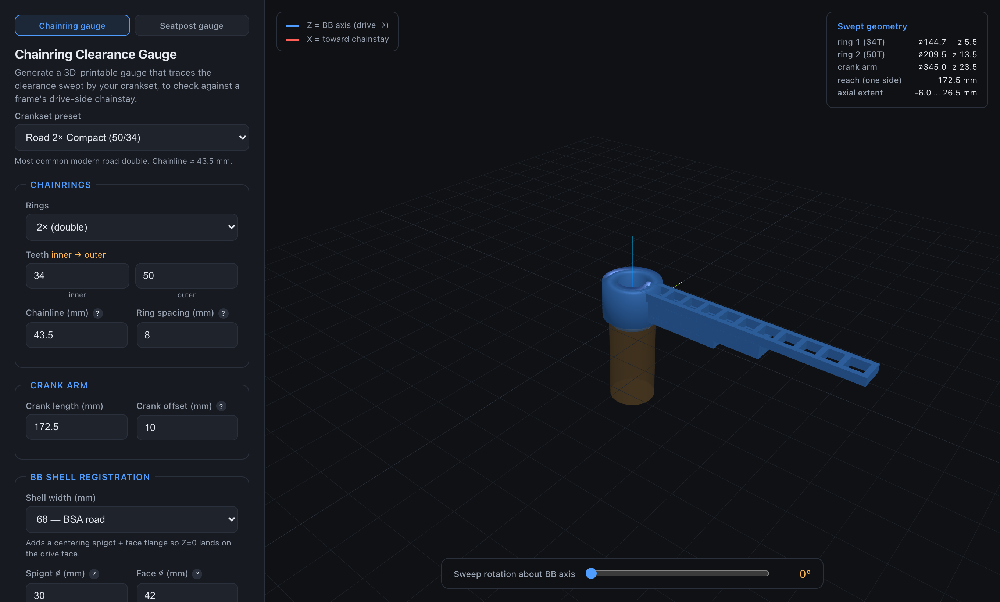
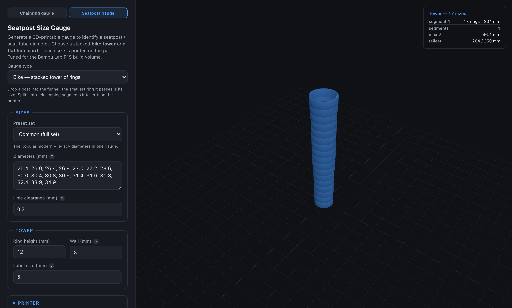
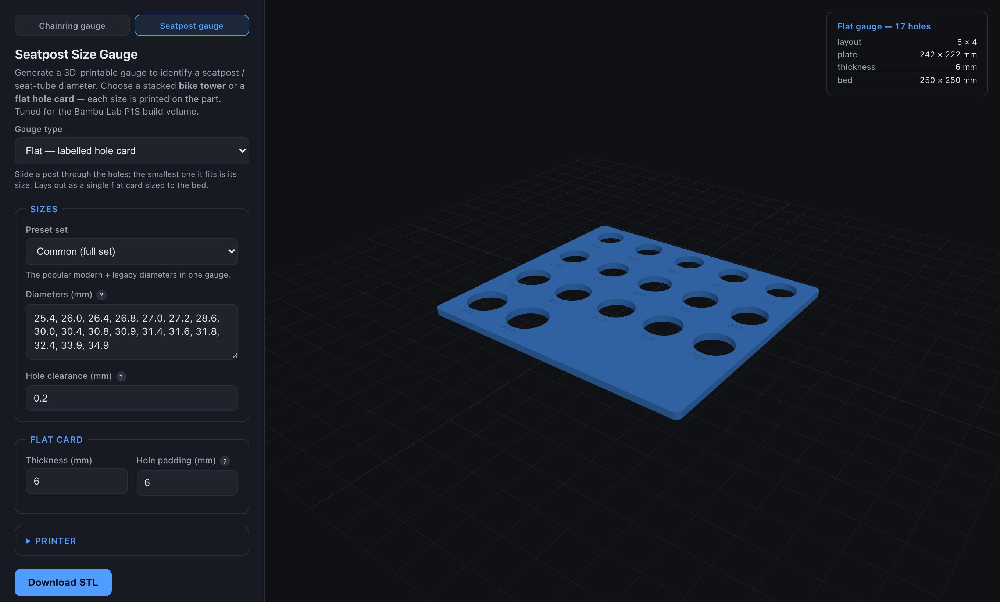

# Bike Gauge Generators

Browser apps that **live-preview** 3D-printable bicycle gauges and **download STLs** — no
backend, no build step, everything runs client-side in three.js. Two tools share one static
site (top-nav switches between them):

1. **Chainring clearance gauge** (`index.html`) — traces the clearance swept by a crankset's
   chainring(s) and crank arm, to check against a frame's drive-side chainstay.
2. **Seatpost size gauge** (`seatpost-gauge.html`) — identifies a seatpost / seat-tube
   diameter, defaulted to a set of common seatpost sizes.

**Live:** https://chainring-generator.vercel.app

| Chainring clearance gauge | Seatpost tower | Seatpost hole card |
|---|---|---|
|  |  |  |

## Architecture

A **fully static, client-side app** — no backend, no build step. It deploys to any static host
(Vercel zero-config).

| Layer | Tech | Role |
|---|---|---|
| Preview | three.js (ES modules via CDN) | Live 3D preview of the gauge geometry |
| STL export | three's `STLExporter`, in-browser | Binary STL from the same geometry shown in the preview |
| Engraving | `three-bvh-csg` (CDN) | Cuts the seatpost size labels *into* the surfaces (CSG subtraction) |
| Hosting | Vercel static (`public/`) | Zero-config deploy |

Geometry is built once and used for both the preview and the downloaded STL — what you see is
what you get. Both tools assemble revolved annular tubes (`LatheGeometry`), boxes, and extruded
shapes into a multi-body STL that slicers handle fine; the chainring tool needs no boolean ops,
while the seatpost tool uses CSG only to deboss its labels.

---

## Chainring clearance gauge


Pick an industry preset (road compact, sub-compact, gravel/MTB 1×, touring triple, …) or
enter your own measured values. Rotate the gauge about the BB axis with the sweep slider to
find the worst-case clearance position.

> An earlier version used a Python serverless function as the authoritative STL generator. It
> was removed once the JS geometry (including the bore) matched it exactly — the browser does
> everything, so the backend was pure overhead. The original reference implementation is kept
> at `chainring_clearance_gauge.py` for provenance, but it is not used by the app.

**Printability:** multi-ring gauges merge into one continuous *stepped* solid (each ring keeps
its true radius, but the axial bands join at the midpoints so there are no floating fins or air
gaps), and the outer ring extends out to meet the crank fin so the whole gauge is one connected
body. The crank fin defaults to a thin 6 mm to save plastic, and the centering spigot is a
short stub (6 mm) rather than reaching the shell centerline — the face flange sets the Z=0
reference, so a short spigot is enough to center radially. When a shell flange is used, the
central hub widens to the flange diameter so the part has one large flat circular base to print
on (no thin protruding flange), hollowed by a generous bore. The ring and crank fins are built
as trussed frames with evenly spaced windows to cut filament further.

### Coordinate system

- `+Z` = BB spindle axis, pointing to the drive side. `Z = 0` = drive-side BB-shell face.
- Fins point along `+X` (toward the chainstay). Rotating about `Z` sweeps the clearance circle.
- Chainring OD uses the ANSI sprocket formula `D = p·(0.6 + cot(180/N))`, `p = 12.7 mm`,
  which runs a few mm oversize — safe for a clearance gauge.

### Parameters

| field | default | notes |
|---|---|---|
| rings | 1 | 1–3 |
| teeth | 32 | per ring, inner→outer (e.g. `34, 50`) |
| chainline | 43.5 | mm, frame centerline (seat-tube/BB-shell center) → center of the ring group (single ring 1×, midpoint 2×, middle ring 3×). Needs shell width; else from the drive face |
| spacing | 0 | mm between rings |
| crank | 170 | mm, BB axis → pedal axle |
| crank offset | 10 | mm the crank sits outboard of the outer ring |
| shell width | — | 68 / 73; adds shell registration |
| style | arms | `arms` (rotatable fins) or `disk` (solid envelope) |
| spigot ⌀ | 30 | mm; = shell inner bore |
| face ⌀ | 42 | mm; ≥ shell OD |
| spigot depth | 6 | mm the centering spigot reaches into the shell |
| ring thickness | 3 | axial mm per ring |
| fin width | 15 | tangential mm of ring fins |
| crank thickness | 6 | axial mm of crank fin |
| crank width | 18 | tangential mm of crank fin |
| hub radius | 12 | mm (with a shell flange, the hub auto-widens to the flange ⌀ for a flat print base) |
| bore | 20 | alignment-rod hole ⌀; larger = less filament; 0 = none |
| margin | 0 | mm added to every radius (safety inflation) |
| lightening holes | on | trussed windows in the ring/crank fins to cut filament (arms style) |

---

## Seatpost size gauge

Identifies a seatpost outer diameter (or seat-tube bore). It defaults to a set of common
seatpost sizes (editable, with presets) and is tuned for the **Bambu Lab P1S** build volume
(256 × 256 × 256 mm; the UI defaults to a 250 mm safety margin). Two styles:

### Bike — stacked tower of rings


A vertical funnel of rings, smallest bore at the bottom, each engraved with its size. Drop a
post in from the top; it descends until it reaches a ring too small to pass — the smallest ring
it cleared is its size.

If the tower is taller than the printer's Z, it **splits into interconnecting segments** that
telescope together: each upper segment carries a `skirt` that slips over the ring below it, plus
a solid `cap` the rings above sit on. The rings and the coupler are revolved tubes
(`LatheGeometry`), so the bore stays clear.

### Flat — labelled hole card


One flat plate with an engraved, labelled through-hole per size, auto-arranged into a grid that
fits the bed. Slide a post through the holes to find its size. Built as a single
`ExtrudeGeometry` from a rectangle `Shape` with circular `Path` holes (real holes, no boolean).

### Engraved labels

Size labels are **debossed** (cut *into* the surface), not raised — raised digits would foul the
fit, jam the telescoping skirt, or stop the card sitting flat. Each label is built as
`TextGeometry` (Helvetiker, loaded via CDN) and subtracted from the part with `three-bvh-csg`
(CSG). On the curved ring faces the cutter is sunk an extra chord-sagitta so the whole number
breaks the surface while leaving wall behind it. If the CSG library fails to load, engraving is
skipped gracefully (the part still prints, just without numbers).

### Parameters

| field | default | notes |
|---|---|---|
| gauge type | tower | `tower` (stacked rings) or `plate` (flat hole card) |
| sizes | common set | comma/space separated mm; deduped & sorted. Presets: common / modern / legacy / full range |
| hole clearance | 0.2 | mm added to every labelled diameter — FDM holes print undersize, so a small positive value makes the real opening match the printed number. `0` = tight reference fit |
| ring height | 12 | mm tall per ring (tower) |
| wall | 3 | mm radial ring wall (tower) / spacing between holes & to the edge (plate) |
| label size | 5 | mm height of the engraved digits |
| plate thickness | 6 | mm (plate) |
| hole padding | 6 | mm gap around each hole in its cell (plate) |
| max height | 250 | mm usable Z; towers taller than this split into segments |
| max bed | 250 | mm usable bed X/Y |

---

## Develop locally

It's static, so any file server works — e.g.:

```bash
python3 -m http.server --directory public 8000   # then open http://localhost:8000
```

or `vercel dev` if you prefer the Vercel toolchain. (Opening the HTML files directly off disk
also works.)

## Deploy

```bash
vercel --prod
```

Or connect the repo in the Vercel dashboard — zero config. Vercel serves `public/` statically.

## Files

```
public/index.html              chainring gauge UI
public/seatpost-gauge.html     seatpost gauge UI
public/styles.css              shared styles (nav, forms, viewer)
public/app.js                  chainring: three.js preview + form + STL export
public/seatpost-gauge.js       seatpost: three.js preview + form + CSG engraving + STL export
screenshots/                   README images
chainring_clearance_gauge.py   original chainring reference (not used by the app)
```

> **Disclaimer:** presets and sizes are industry-typical starting points. FDM prints holes
> slightly undersize — tune the clearance and verify against a known part with calipers before
> trusting any gauge.
